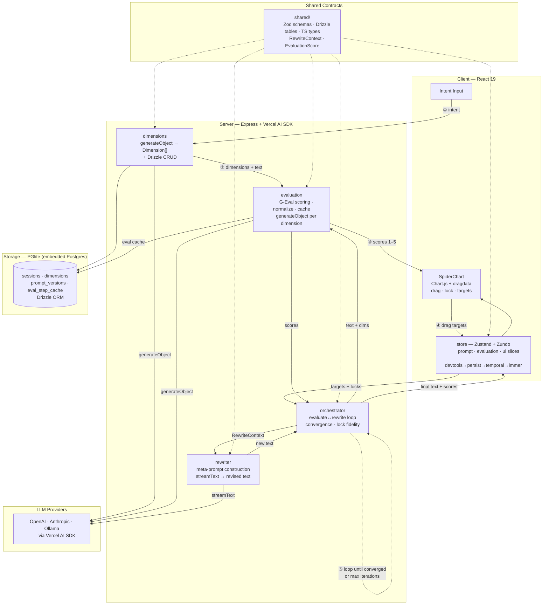

# textchisel — Architecture Document

**v0.1 — March 2026**

---

## Data Flow Diagram



---

## Confirmed Tech Stack

| Component         | Choice                                                                  |
| ----------------- | ----------------------------------------------------------------------- |
| Language          | TypeScript (monorepo)                                                   |
| Frontend          | React 19                                                                |
| Runtime           | Node.js (single process: serves UI + proxies LLM calls)                 |
| LLM Integration   | Vercel AI SDK (`ai` + `@ai-sdk/openai` + `@ai-sdk/anthropic`)           |
| Database          | PGlite (embedded Postgres, in-process)                                  |
| Reactive State    | PGlite `useLiveQuery` (data) + Zustand (UI state + undo/redo via Zundo) |
| Spider Chart      | Chart.js + chartjs-plugin-dragdata                                      |
| Versioning        | Immutable PromptVersion snapshots                                       |
| Deployment        | localhost only                                                          |
| Agentic Framework | None — plain TypeScript orchestration                                   |

---

## 1. System Overview

```
┌─────────────────────────────────────────────────────────────────────┐
│                         USER LAYER                                  │
│                                                                     │
│  ┌──────────┐  ┌──────────────┐  ┌───────────┐  ┌──────────────┐  │
│  │ Intent   │  │ Dimension    │  │ Spider    │  │ Version      │  │
│  │ Input    │  │ Proposal     │  │ Chart     │  │ Timeline     │  │
│  │          │  │              │  │ (drag +   │  │              │  │
│  │          │  │              │  │  lock)    │  │              │  │
│  └────┬─────┘  └──────┬───────┘  └─────┬─────┘  └──────────────┘  │
│       │               │                │                            │
└───────┼───────────────┼────────────────┼────────────────────────────┘
        │               │                │
        ▼               ▼                ▼
┌─────────────────────────────────────────────────────────────────────┐
│                     ORCHESTRATION LAYER                              │
│                                                                     │
│  ┌──────────────────┐  ┌──────────────────┐  ┌──────────────────┐  │
│  │ Dimension        │  │ Regeneration     │  │ Version          │  │
│  │ Generation       │  │ Loop             │  │ Manager          │  │
│  │ Pipeline         │  │ Orchestrator     │  │                  │  │
│  └────────┬─────────┘  └───────┬──────────┘  └──────────────────┘  │
│           │                    │                                     │
└───────────┼────────────────────┼────────────────────────────────────┘
            │                    │
            │         ┌─────────┴──────────┐
            │         │                    │
            ▼         ▼                    ▼
┌────────────────────────────┐  ┌────────────────────────────────────┐
│      GRAMMAR LAYER         │  │        EVALUATION LAYER            │
│                            │  │                                    │
│  Takes: current prompt,    │  │  Takes: prompt + rubric            │
│  free dimension + target,  │  │  Returns: score per dimension      │
│  locked dimensions         │  │                                    │
│                            │  │  G-Eval style:                     │
│  Returns: modified prompt  │  │  1. Auto-gen evaluation steps      │
│                            │  │  2. Score via structured output    │
│  Single LLM call (MVP)     │  │  3. Multi-sample avg (N=3)        │
│  CriSPO/TextGrad (Phase 2) │  │  4. All dimensions in parallel    │
│                            │  │                                    │
└────────────┬───────────────┘  └──────────────┬─────────────────────┘
             │                                  │
             └──────────┬───────────────────────┘
                        │
                        ▼
              ┌──────────────────┐
              │   LLM PROVIDER   │
              │  (Vercel AI SDK) │
              │                  │
              │  OpenAI / Claude │
              │  / Ollama / etc. │
              └──────────────────┘
                        │
                        ▼
              ┌──────────────────┐
              │     PGlite       │
              │  (embedded PG)   │
              │                  │
              │  Sessions        │
              │  PromptVersions  │
              │  Dimensions      │
              │  EvalStepCache   │
              └──────────────────┘
```

### LLM Call Points

| Call                  | Layer                             | When                   | Parallel?                  |
| --------------------- | --------------------------------- | ---------------------- | -------------------------- |
| `generateDimensions`  | Orchestration                     | User submits intent    | No — single call           |
| `modifyPrompt`        | Grammar                           | User clicks Regenerate | No — single call, streamed |
| `scorePrompt` × 3     | Evaluation                        | After prompt generated | Yes — all 3 in parallel    |
| `scorePrompt` × 3 × 3 | Evaluation (with noise reduction) | After prompt generated | Yes — 9 calls in parallel  |

---

## 2. Data Models

### Session

```typescript
interface Session {
  id: string; // UUID
  userIntent: string; // "Write a cold email to a Series B investor..."
  currentVersionId: string; // Points to active PromptVersion
  createdAt: Date;
  updatedAt: Date;
}
```

### Dimension

```typescript
interface Dimension {
  id: string; // UUID
  sessionId: string;
  name: string; // User-facing: "Urgency"
  rubric: Rubric; // Full rubric definition
  currentScore: number; // Latest evaluated score (native scale)
  targetScore: number | null; // User's target (null = no target set)
  locked: boolean; // Is this dimension locked?
  displayOrder: number; // Position on spider chart (0, 1, 2)
  createdAt: Date;
}
```

### Rubric

The rubric is the most complex model. It must support multiple measurement types even if MVP only uses the simpler ones.

```typescript
interface Rubric {
  id: string; // UUID
  dimensionId: string;
  description: string; // Natural language: "Measures the level of time pressure..."
  rubricType: RubricType;
  levels: RubricLevel[]; // Ordered scoring levels
  evaluationSteps: string[]; // Auto-generated G-Eval steps (cached)
  scoreRange: {
    min: number;
    max: number;
  };
  normalizedRange: {
    // For spider chart display (0-1)
    min: 0;
    max: 1;
  };
}

type RubricType =
  | "ordinal" // Discrete levels with linguistic markers (Urgency)
  | "count" // Raw integer count (Personalization Depth)
  | "taxonomic" // Classification against a hierarchy (Ask Directness)
  | "extremum" // Scored by most extreme instance
  | "graph_theoretic" // Structural properties
  | "ratio" // Ratio-based annotation density
  | "simulation" // Simulated reader comprehension
  | "narratological" // Narrative theory classification
  | "dialectical" // Philosophical dialectical analysis
  | "topological"; // Mathematical classification

interface RubricLevel {
  level: number; // 1, 2, 3, 4, 5
  label: string; // "No temporal language"
  description: string; // Full description of what this level means
  indicators: string[]; // Observable markers: ["no deadlines", "no urgency words"]
}
```

### PromptVersion

Immutable snapshot. Never updated — only appended.

```typescript
interface PromptVersion {
  id: string; // UUID
  sessionId: string;
  versionNumber: number; // Sequential within session
  parentVersionId: string | null; // What version this was derived from

  // The prompt
  promptText: string;

  // Full dimension state (denormalized snapshot)
  dimensionScores: Record<string, DimensionSnapshot>;

  // What caused this version
  action: VersionAction;

  createdAt: Date;
}

interface DimensionSnapshot {
  dimensionId: string;
  name: string;
  score: number; // Evaluated score (native scale)
  normalizedScore: number; // 0-1 for spider chart
  targetScore: number | null;
  locked: boolean;
}

type VersionAction =
  | { type: "initial" }
  | { type: "regenerate"; freeDimensionId: string; targetValue: number }
  | { type: "revert"; fromVersionId: string }
  | { type: "lock_change"; dimensionId: string; locked: boolean };
```

### GrammarInstruction

The internal representation the grammar layer uses. MVP: a structured object passed to the LLM. Phase 2+: could be a TextGrad Variable or CriSPO instruction set.

```typescript
interface GrammarInstruction {
  currentPrompt: string;
  freeDimension: {
    name: string;
    rubric: Rubric;
    currentScore: number;
    targetScore: number;
    direction: "increase" | "decrease";
  };
  lockedDimensions: Array<{
    name: string;
    rubric: Rubric;
    currentScore: number;
    // The rubric description tells the LLM what "locked" means qualitatively
  }>;
  userIntent: string; // Original intent for context
}
```

### Database Schema (PGlite)

```sql
CREATE TABLE sessions (
  id UUID PRIMARY KEY DEFAULT gen_random_uuid(),
  user_intent TEXT NOT NULL,
  current_version_id UUID,
  created_at TIMESTAMPTZ DEFAULT now(),
  updated_at TIMESTAMPTZ DEFAULT now()
);

CREATE TABLE dimensions (
  id UUID PRIMARY KEY DEFAULT gen_random_uuid(),
  session_id UUID NOT NULL REFERENCES sessions(id),
  name TEXT NOT NULL,
  rubric JSONB NOT NULL,
  current_score REAL,
  target_score REAL,
  locked BOOLEAN DEFAULT false,
  display_order INT NOT NULL,
  created_at TIMESTAMPTZ DEFAULT now()
);

CREATE TABLE prompt_versions (
  id UUID PRIMARY KEY DEFAULT gen_random_uuid(),
  session_id UUID NOT NULL REFERENCES sessions(id),
  version_number INT NOT NULL,
  parent_version_id UUID REFERENCES prompt_versions(id),
  prompt_text TEXT NOT NULL,
  dimension_scores JSONB NOT NULL,
  action JSONB NOT NULL,
  created_at TIMESTAMPTZ DEFAULT now(),
  UNIQUE(session_id, version_number)
);

CREATE TABLE eval_step_cache (
  id UUID PRIMARY KEY DEFAULT gen_random_uuid(),
  dimension_name TEXT NOT NULL,
  rubric_hash TEXT NOT NULL,
  evaluation_steps JSONB NOT NULL,
  created_at TIMESTAMPTZ DEFAULT now(),
  UNIQUE(rubric_hash)
);

CREATE INDEX idx_versions_session ON prompt_versions(session_id, version_number);
CREATE INDEX idx_dimensions_session ON dimensions(session_id);
```

---

## 3. Pipeline Specifications

### 3.1 Dimension Generation Pipeline

**Trigger:** User submits intent text.
**Goal:** Propose 3 dimensions with rubrics in a single LLM call.

```
User intent ──► generateDimensions() ──► 3 Dimensions with Rubrics
                     │
                     └── Single LLM call using generateObject()
                         with Zod schema validation
```

**LLM Call Specification:**

```typescript
import { generateObject } from "ai";
import { z } from "zod";

const DimensionProposalSchema = z.object({
  dimensions: z
    .array(
      z.object({
        name: z.string().describe("Short, user-friendly dimension name"),
        description: z
          .string()
          .describe("One-sentence explanation for the user"),
        rubricType: z.enum(["ordinal", "count", "taxonomic"]),
        levels: z
          .array(
            z.object({
              level: z.number(),
              label: z.string(),
              description: z.string(),
              indicators: z.array(z.string()),
            }),
          )
          .length(5),
        scoreRange: z.object({ min: z.number(), max: z.number() }),
      }),
    )
    .length(3),
});

async function generateDimensions(
  userIntent: string,
): Promise<DimensionProposal> {
  const { object } = await generateObject({
    model: provider(modelId), // User-configured
    schema: DimensionProposalSchema,
    prompt: DIMENSION_GENERATION_PROMPT(userIntent),
  });
  return object;
}
```

**The Dimension Generation Prompt:**

```
You are an expert in text quality assessment. Given a user's writing intent,
propose exactly 3 quality dimensions that:

1. Are meaningful for this specific writing task
2. Are as independent as possible (adjusting one should not force changes in others)
3. Use the user's natural vocabulary (not jargon)
4. Each capture a distinct, coherent mode of variation in the text

For each dimension, create a 5-level rubric where:
- Level 1 is the lowest/weakest expression
- Level 5 is the highest/strongest expression
- Each level has concrete, observable indicators an evaluator can check
- The levels form a clear progression

The rubric IS the dimension. Without precise level descriptions, the dimension
is meaningless. Be specific — "uses formal language" is too vague;
"no contractions, Latinate vocabulary, passive constructions permitted" is good.

User intent: {userIntent}
```

**Validation:** After generation, a heuristic independence check compares the indicator sets across dimensions. If >30% of indicators overlap between two dimensions, flag for user review. (Phase 2: Jacobian analysis replaces this heuristic.)

### 3.2 Evaluation Engine

**Trigger:** A new prompt has been generated (or initial prompt created).
**Goal:** Score the prompt on all 3 dimensions in parallel.

```
Prompt text ──┬──► scorePrompt(dim1) ──► score1 ─┐
              ├──► scorePrompt(dim2) ──► score2 ──┼──► aggregate ──► update chart
              └──► scorePrompt(dim3) ──► score3 ─┘

Each scorePrompt() runs N=3 samples, averages for noise reduction.
All 3 dimensions scored in parallel via Promise.all().
Total parallel calls: 3 dimensions × 3 samples = 9 LLM calls (all concurrent).
```

**Evaluation Steps Generation (cached per rubric):**

Following G-Eval, evaluation steps are auto-generated once per dimension and cached.

```typescript
const EvalStepsSchema = z.object({
  steps: z.array(z.string()).min(3).max(6),
});

async function generateEvalSteps(dimension: Dimension): Promise<string[]> {
  // Check cache first
  const cached = await getCachedEvalSteps(dimension.rubric);
  if (cached) return cached;

  const { object } = await generateObject({
    model: provider(modelId),
    schema: EvalStepsSchema,
    prompt: EVAL_STEPS_PROMPT(dimension),
  });

  await cacheEvalSteps(dimension.rubric, object.steps);
  return object.steps;
}
```

**Eval Steps Generation Prompt:**

```
You are an expert evaluator. Given a quality dimension and its rubric,
generate 3-6 concrete evaluation steps that a judge should follow
to score a text on this dimension.

Each step should be:
- Actionable: "Count the number of..." not "Consider whether..."
- Observable: reference specific textual features
- Ordered: follow a logical evaluation sequence

Dimension: {dimension.name}
Rubric: {JSON.stringify(dimension.rubric.levels)}

Output evaluation steps as an ordered list.
```

**Scoring Call:**

```typescript
const ScoreSchema = z.object({
  reasoning: z.string().describe("Step-by-step evaluation following the steps"),
  score: z.number().describe("Score on the rubric scale"),
  confidence: z.enum(["high", "medium", "low"]),
});

async function scorePrompt(
  prompt: string,
  dimension: Dimension,
  evalSteps: string[],
): Promise<Score> {
  // Run N=3 samples in parallel for noise reduction
  const samples = await Promise.all(
    Array.from({ length: 3 }, () =>
      generateObject({
        model: provider(modelId),
        schema: ScoreSchema,
        prompt: SCORING_PROMPT(prompt, dimension, evalSteps),
        temperature: 0.3, // Slight variation for diversity
      }),
    ),
  );

  // Average the scores, keep median reasoning
  const scores = samples.map((s) => s.object.score);
  const avgScore = scores.reduce((a, b) => a + b, 0) / scores.length;

  return {
    score: avgScore,
    normalizedScore: normalize(avgScore, dimension.rubric.scoreRange),
    reasoning: samples[Math.floor(samples.length / 2)].object.reasoning,
    confidence: deriveConfidence(scores), // High if std < 0.5, Low if std > 1.0
    rawScores: scores,
  };
}
```

**Scoring Prompt:**

```
You are evaluating a text against a specific quality dimension.

## Dimension: {dimension.name}

## Rubric Levels:
{for each level in dimension.rubric.levels:}
  Level {level.level} — {level.label}: {level.description}
  Indicators: {level.indicators.join(', ')}
{end}

## Evaluation Steps (follow these in order):
{evalSteps.map((step, i) => `${i+1}. ${step}`).join('\n')}

## Text to Evaluate:
{promptText}

Evaluate the text by following each step. Then assign a score from
{scoreRange.min} to {scoreRange.max} based on which rubric level
best matches your evaluation.
```

**Normalization:**

```typescript
function normalize(score: number, range: { min: number; max: number }): number {
  return (score - range.min) / (range.max - range.min);
}

function denormalize(
  normalized: number,
  range: { min: number; max: number },
): number {
  return normalized * (range.max - range.min) + range.min;
}
```

Internal scoring preserves native scales. Normalization happens only at the spider chart boundary.

### 3.3 Grammar Layer (IK Solver)

**Trigger:** User clicks Regenerate after adjusting a slider.
**Goal:** Produce a modified prompt that moves the free dimension toward the target while respecting locks.

This is the most important prompt in the system.

```
GrammarInstruction ──► modifyPrompt() ──► streamed modified prompt
                           │
                           └── Single LLM call using streamText()
```

**Grammar Layer Meta-Prompt (the core prompt):**

```
You are a precise text modification engine. Your job is to modify a prompt
to change ONE specific quality while preserving all others.

## CURRENT PROMPT:
{currentPrompt}

## DIMENSION TO CHANGE: {freeDimension.name}
Current level: {freeDimension.currentScore} out of {freeDimension.rubric.scoreRange.max}
Target level: {freeDimension.targetScore} out of {freeDimension.rubric.scoreRange.max}
Direction: {freeDimension.direction === 'increase' ? 'INCREASE' : 'DECREASE'}

### What this dimension means (rubric):
{for each level in freeDimension.rubric.levels:}
  Level {level.level} — {level.label}: {level.description}
{end}

### What the target level looks like:
{targetLevel.description}
Indicators to ADD: {targetLevel.indicators.join(', ')}

### What the current level looks like:
{currentLevel.description}
Indicators to REMOVE or REDUCE: {currentLevel.indicators.join(', ')}

## LOCKED DIMENSIONS (MUST PRESERVE):
{for each locked in lockedDimensions:}
  ### {locked.name} — LOCKED at Level {locked.currentScore}
  This means: {locked.rubric.levels[locked.currentScore - 1].description}
  Indicators that MUST remain present: {locked.rubric.levels[locked.currentScore - 1].indicators.join(', ')}
{end}

## MODIFICATION RULES:
1. Make the MINIMUM changes necessary to move toward the target level.
   Do NOT rewrite the entire prompt. Preserve structure, tone, and content
   that is not directly related to the dimension being changed.
2. The locked dimensions describe qualities that MUST be maintained.
   If changing {freeDimension.name} would naturally affect a locked dimension,
   make compensating adjustments to maintain the locked score.
3. Output ONLY the modified prompt text. No explanations, no commentary.

## ORIGINAL USER INTENT (for context):
{userIntent}

## MODIFIED PROMPT:
```

**Implementation:**

```typescript
import { streamText } from "ai";

async function modifyPrompt(
  instruction: GrammarInstruction,
): Promise<ReadableStream> {
  const result = streamText({
    model: provider(modelId),
    prompt: GRAMMAR_META_PROMPT(instruction),
    temperature: 0.4, // Low for precision, not zero for diversity
  });

  return result.textStream;
}
```

**Extension Point:** The `modifyPrompt` function accepts a `GrammarInstruction` and returns a stream. Phase 2 can swap in CriSPO (critique → suggestion → edit), TextGrad (textual gradient descent), or a multi-step pipeline — all behind the same interface.

### 3.4 Regeneration Loop Orchestration

**The full pipeline from slider move to chart update:**

```
1. User adjusts slider on free dimension
   │
2. User clicks "Regenerate"
   │
3. Build GrammarInstruction from current state
   │
4. Grammar Layer: streamText() ──► stream prompt tokens to PromptDisplay
   │                                (user sees text appearing immediately)
   │
5. On stream complete: full prompt text available
   │
6. Evaluation Layer: Promise.all([
   │   scorePrompt(prompt, dim1),  // 3 samples each
   │   scorePrompt(prompt, dim2),  // all 9 calls concurrent
   │   scorePrompt(prompt, dim3),
   │ ])
   │
7. Check lock fidelity:
   │   for each locked dimension:
   │     if |newScore - lockedScore| > LOCK_TOLERANCE (0.5 on 1-5 scale):
   │       flag deviation in UI
   │
8. Create PromptVersion snapshot (immutable insert)
   │
9. Update spider chart with new scores
   │
10. Update undo/redo stack
```

**Optimistic Updates:**

While steps 4-6 are running, the UI shows:

- Step 4 start: Spinner on chart, "Generating..." status
- Step 4 streaming: Prompt text appears progressively
- Step 5 start: Show interpolated predicted scores on chart (dimmed)
- Step 6 complete: Replace predicted scores with real scores (animated transition)

**Lock Fidelity Handling:**

```typescript
const LOCK_TOLERANCE = 0.5; // On a 1-5 scale

function checkLockFidelity(
  lockedDimensions: Dimension[],
  newScores: Record<string, Score>,
): LockDeviation[] {
  return lockedDimensions
    .map((dim) => ({
      dimensionId: dim.id,
      dimensionName: dim.name,
      expectedScore: dim.currentScore,
      actualScore: newScores[dim.id].score,
      deviation: Math.abs(newScores[dim.id].score - dim.currentScore),
    }))
    .filter((d) => d.deviation > LOCK_TOLERANCE);
}
```

If deviations are detected AND retry hasn't been attempted, the system automatically retries once (see Lock Fidelity Retry below). If the retry also deviates, the UI shows a warning: "Urgency shifted from 4.0 to 3.2 (locked at 4.0). Accept or revert?"

**Lock Fidelity Retry (max 1 retry):**

When lock deviation exceeds threshold after the first generation, the system re-runs the grammar layer with deviation feedback:

```typescript
async function regenerateWithLockRetry(
  instruction: GrammarInstruction,
  firstAttemptScores: Record<string, Score>,
  deviations: LockDeviation[],
): Promise<{ textStream: ReadableStream<string>; fullText: Promise<string> }> {
  // Append deviation feedback to the grammar instruction
  const retryInstruction: GrammarInstruction = {
    ...instruction,
    lockDeviationFeedback: deviations.map(
      (d) =>
        `WARNING: Your previous attempt shifted "${d.dimensionName}" from ${d.expectedScore} to ${d.actualScore}. ` +
        `This dimension is LOCKED at ${d.expectedScore}. You MUST preserve it. ` +
        `Adjust your modifications to maintain this score.`,
    ),
  };

  return modifyPrompt(retryInstruction);
}
```

This adds one retry (grammar call + scoring) when locks drift — worst case adds ~3-5s, but only triggers when needed. The GrammarInstruction type gains an optional `lockDeviationFeedback: string[]` field appended to the meta-prompt's LOCKED DIMENSIONS section.

### 3.5 Provider-Aware Parallelism

Different LLM providers have different concurrency capabilities. The scoring strategy adapts accordingly.

```typescript
interface ProviderCapabilities {
  maxConcurrentRequests: number; // Ollama: 1, Cloud APIs: 20+
  samplesPerDimension: number; // Ollama: 1, Cloud: 3
  supportsStructuredOutput: boolean;
}

const PROVIDER_DEFAULTS: Record<string, ProviderCapabilities> = {
  openai: {
    maxConcurrentRequests: 20,
    samplesPerDimension: 3,
    supportsStructuredOutput: true,
  },
  anthropic: {
    maxConcurrentRequests: 20,
    samplesPerDimension: 3,
    supportsStructuredOutput: true,
  },
  ollama: {
    maxConcurrentRequests: 1,
    samplesPerDimension: 1,
    supportsStructuredOutput: false,
  },
};

async function scoreAllAdaptive(
  promptText: string,
  dimensions: Dimension[],
  capabilities: ProviderCapabilities,
): Promise<Record<string, Score>> {
  const N = capabilities.samplesPerDimension;
  const tasks = dimensions.flatMap((dim) =>
    Array.from({ length: N }, () => ({
      dim,
      fn: () => scoreSingle(promptText, dim),
    })),
  );

  // Respect concurrency limit
  const results = await pLimit(capabilities.maxConcurrentRequests)(tasks);

  // Group by dimension and average
  return groupAndAverage(results, dimensions);
}
```

**Impact on latency:**

| Provider         | Parallel calls | Samples | Scoring duration        |
| ---------------- | -------------- | ------- | ----------------------- |
| OpenAI/Anthropic | 9 concurrent   | N=3     | ~1.5-2.5s               |
| Ollama           | 1 sequential   | N=1     | ~4-8s (model-dependent) |

For Ollama, total loop time may exceed 8s. This is acceptable — local models trade latency for cost ($0).

### 3.6 Error Handling

Every LLM call is wrapped in a resilient execution pattern.

```typescript
interface LLMCallOptions {
  maxRetries: number; // Default: 2
  retryDelayMs: number; // Default: 1000 (exponential backoff)
  timeoutMs: number; // Default: 30000
}

async function resilientLLMCall<T>(
  callFn: () => Promise<T>,
  options: LLMCallOptions = {
    maxRetries: 2,
    retryDelayMs: 1000,
    timeoutMs: 30000,
  },
): Promise<T> {
  let lastError: Error;

  for (let attempt = 0; attempt <= options.maxRetries; attempt++) {
    try {
      return await withTimeout(callFn(), options.timeoutMs);
    } catch (error) {
      lastError = error as Error;

      if (isNonRetryable(error)) throw error; // Invalid API key, model not found
      if (attempt < options.maxRetries) {
        await delay(options.retryDelayMs * Math.pow(2, attempt));
      }
    }
  }

  throw lastError!;
}

function isNonRetryable(error: unknown): boolean {
  if (error instanceof Error) {
    const msg = error.message.toLowerCase();
    return (
      msg.includes("invalid api key") ||
      msg.includes("model not found") ||
      msg.includes("authentication")
    );
  }
  return false;
}
```

**Error states in the UI:**

| Error                           | User sees                                     | Recovery                            |
| ------------------------------- | --------------------------------------------- | ----------------------------------- |
| Invalid API key                 | "API key is invalid. Check Settings."         | Settings panel opens                |
| Rate limited                    | "Rate limited. Retrying in {N}s..."           | Auto-retry with backoff             |
| Model not found                 | "Model '{id}' not available. Check Settings." | Settings panel opens                |
| Network timeout                 | "Request timed out. Try again?"               | Manual retry button                 |
| Structured output parse failure | "Scoring failed. Retrying..."                 | Auto-retry (up to 2x)               |
| All retries exhausted (scoring) | Prompt displayed, scores show "—"             | "Scores unavailable. Retry?" button |

**Graceful degradation:** If scoring fails but generation succeeds, the user still sees the new prompt text. Scores show as unavailable rather than crashing the app.

---

## 4. Component Tree

```
<App>
  <PGliteProvider>                     ← PGlite instance + Drizzle ORM
    <AppLayout>
      <Header />
      <MainContent>
        ├── <IntentInput />            ← Text field for user intent
        │     onSubmit → generateDimensions()
        │
        ├── <DimensionProposal />      ← Shows proposed dims, accept/reject
        │     visible only before dims are confirmed
        │
        ├── <WorkspacePanel>           ← Main workspace after dims confirmed
        │     ├── <SpiderChart />      ← Chart.js radar, draggable vertices
        │     │     data ← PGlite useLiveQuery (dimension scores)
        │     │     onDrag → update target score in Zustand
        │     │     onLockToggle → toggle dimension lock
        │     │
        │     ├── <PromptDisplay />    ← Shows current prompt, streams new text
        │     │     text ← PGlite useLiveQuery (current version prompt_text)
        │     │     streaming ← Zustand (streamingText)
        │     │     diff highlighting via diff-match-patch
        │     │
        │     ├── <DimensionPanel />   ← Sidebar: rubric details per dimension
        │     │     ├── <DimensionCard /> × 3
        │     │     │     name, rubric summary, score, target, lock toggle
        │     │     │     numeric input for precise target setting
        │     │     └── <RegenerateButton />
        │     │
        │     └── <VersionTimeline />  ← Scrollable history
        │           ├── <VersionChip /> × N
        │           │     click → revert to version
        │           │     hover → preview scores
        │           └── compare mode: select two versions for diff
        │
        └── <ExportButton />           ← Copy to clipboard
      </MainContent>
    </AppLayout>
  </SessionProvider>
</App>
```

### Component State Dependencies

| Component         | PGlite useLiveQuery (persistent, reactive) | Zustand (ephemeral UI state)     |
| ----------------- | ------------------------------------------ | -------------------------------- |
| SpiderChart       | dimension scores, lock states              | target scores, hover state       |
| PromptDisplay     | current version prompt_text                | streaming text, diff mode        |
| DimensionPanel    | dimensions, rubrics, scores                | slider positions                 |
| VersionTimeline   | all prompt_versions                        | selected comparison pair         |
| DimensionProposal | —                                          | proposed dimensions (pre-commit) |
| RegenerateButton  | —                                          | isRegenerating, canRegenerate    |

---

## 5. State Shape

### PGlite Reactive Queries (Persistent, Reactive)

PGlite's `useLiveQuery` hook from `@electric-sql/pglite-react` provides reactive queries that auto-update when underlying data changes.

```typescript
import { useLiveQuery } from "@electric-sql/pglite-react";
import { db } from "../db/client"; // Drizzle instance over PGlite
import { sessions, dimensions, promptVersions } from "../db/schema";

// Reactive queries used by components — re-render on data change
function useSessionDimensions(sessionId: string) {
  return useLiveQuery(
    db.select().from(dimensions).where(eq(dimensions.sessionId, sessionId)),
  );
}

function useVersionHistory(sessionId: string) {
  return useLiveQuery(
    db
      .select()
      .from(promptVersions)
      .where(eq(promptVersions.sessionId, sessionId))
      .orderBy(promptVersions.versionNumber),
  );
}

function useCurrentVersion(versionId: string) {
  return useLiveQuery(
    db.select().from(promptVersions).where(eq(promptVersions.id, versionId)),
  );
}
```

### Zustand Store (Ephemeral UI State)

```typescript
interface UIState {
  // Session flow
  activeSessionId: string | null;
  phase: "intent_input" | "dimension_proposal" | "workspace";

  // Dimension proposal (before committing to DB)
  proposedDimensions: DimensionProposal | null;

  // Regeneration
  isRegenerating: boolean;
  streamingText: string; // Accumulated streamed text
  optimisticScores: Record<string, number> | null; // Predicted scores

  // Spider chart interaction
  targetScores: Record<string, number>; // Slider target positions
  hoveredDimension: string | null;

  // Version comparison
  compareMode: boolean;
  compareVersionIds: [string, string] | null;

  // Undo/redo
  undoStack: string[]; // Version IDs
  undoPointer: number; // Current position in stack

  // LLM config
  provider: "openai" | "anthropic" | "ollama";
  modelId: string;
  apiKey: string;

  // Cost tracking
  sessionCallCount: number; // Total LLM calls this session
  sessionEstimatedCost: number; // Estimated $ cost this session

  // Error state
  lastError: { message: string; recoverable: boolean } | null;
}

interface UIActions {
  // Session
  setPhase: (phase: UIState["phase"]) => void;

  // Regeneration
  startRegeneration: () => void;
  appendStreamText: (chunk: string) => void;
  completeRegeneration: (scores: Record<string, Score>) => void;

  // Spider chart
  setTargetScore: (dimensionId: string, score: number) => void;

  // Undo/redo
  undo: () => void;
  redo: () => void;
  pushVersion: (versionId: string) => void;
}
```

### Undo/Redo Implementation

```typescript
// Undo = move pointer back, load that version's state
function undo() {
  if (undoPointer <= 0) return;
  undoPointer--;
  const versionId = undoStack[undoPointer];
  loadVersion(versionId); // Updates currentVersionId in session
}

// Redo = move pointer forward
function redo() {
  if (undoPointer >= undoStack.length - 1) return;
  undoPointer++;
  const versionId = undoStack[undoPointer];
  loadVersion(versionId);
}

// New version = truncate redo history, push
function pushVersion(versionId: string) {
  undoStack = undoStack.slice(0, undoPointer + 1);
  undoStack.push(versionId);
  undoPointer = undoStack.length - 1;
}
```

---

## 6. API Contracts

Since this is localhost-only with a single Node.js process, the API is internal function calls — not REST endpoints. But the interfaces are defined cleanly for future extraction.

### Core Operations

```typescript
// ─── Dimension Generation ───────────────────────────────────

interface DimensionService {
  /**
   * Generate 3 dimensions with rubrics from user intent.
   * Single LLM call using generateObject().
   */
  generateDimensions(userIntent: string): Promise<DimensionProposal>;

  /**
   * Commit proposed dimensions to the database.
   * Creates Dimension rows and generates+caches eval steps.
   */
  commitDimensions(
    sessionId: string,
    proposal: DimensionProposal,
  ): Promise<Dimension[]>;
}

// ─── Grammar Layer ──────────────────────────────────────────

interface GrammarService {
  /**
   * Modify prompt to move free dimension toward target.
   * Returns a readable stream for progressive display.
   *
   * Extension point: Phase 2 can swap implementation to
   * CriSPO, TextGrad, or multi-step pipeline.
   */
  modifyPrompt(instruction: GrammarInstruction): Promise<{
    textStream: ReadableStream<string>;
    fullText: Promise<string>; // Resolves when stream completes
  }>;
}

// ─── Evaluation Engine ──────────────────────────────────────

interface EvaluationService {
  /**
   * Score a prompt on a single dimension.
   * Runs N=3 samples internally for noise reduction.
   */
  scorePrompt(promptText: string, dimension: Dimension): Promise<Score>;

  /**
   * Score a prompt on all dimensions in parallel.
   * Wrapper around scorePrompt() with Promise.all().
   */
  scoreAll(
    promptText: string,
    dimensions: Dimension[],
  ): Promise<Record<string, Score>>;

  /**
   * Generate and cache evaluation steps for a dimension.
   */
  generateEvalSteps(dimension: Dimension): Promise<string[]>;
}

// ─── Version Manager ────────────────────────────────────────

interface VersionService {
  /**
   * Create a new immutable PromptVersion.
   */
  createVersion(
    sessionId: string,
    promptText: string,
    dimensionScores: Record<string, DimensionSnapshot>,
    action: VersionAction,
    parentVersionId?: string,
  ): Promise<PromptVersion>;

  /**
   * Revert to a previous version.
   * Creates a NEW version with the old version's state.
   */
  revertToVersion(
    sessionId: string,
    targetVersionId: string,
  ): Promise<PromptVersion>;

  /**
   * Get version history for a session.
   */
  getHistory(sessionId: string): Promise<PromptVersion[]>;
}

// ─── Orchestrator ───────────────────────────────────────────

interface RegenerationOrchestrator {
  /**
   * The full regeneration loop.
   * Called when user clicks "Regenerate".
   *
   * 1. Build GrammarInstruction
   * 2. Stream modified prompt (updates UI progressively)
   * 3. Score all dimensions in parallel
   * 4. Check lock fidelity
   * 5. Create PromptVersion
   * 6. Update state
   *
   * Returns the new version and any lock deviations.
   */
  regenerate(
    sessionId: string,
    freeDimensionId: string,
    targetScore: number,
  ): Promise<{
    version: PromptVersion;
    lockDeviations: LockDeviation[];
  }>;
}
```

### Supporting Types

```typescript
interface Score {
  score: number; // Native scale (e.g., 1-5)
  normalizedScore: number; // 0-1 for spider chart
  reasoning: string; // Evaluation reasoning
  confidence: "high" | "medium" | "low";
  rawScores: number[]; // Individual sample scores
}

interface LockDeviation {
  dimensionId: string;
  dimensionName: string;
  expectedScore: number;
  actualScore: number;
  deviation: number;
}

interface DimensionProposal {
  dimensions: Array<{
    name: string;
    description: string;
    rubricType: RubricType;
    levels: RubricLevel[];
    scoreRange: { min: number; max: number };
  }>;
}
```

---

## 7. Latency Analysis

### Target: < 8 seconds from "Regenerate" click to spider chart update

| Phase                | What Happens                                             | Duration                         | Technique                             |
| -------------------- | -------------------------------------------------------- | -------------------------------- | ------------------------------------- |
| 1. Build instruction | Construct GrammarInstruction from state                  | < 5ms                            | In-memory                             |
| 2. Grammar layer     | streamText() — modify prompt                             | 1.5–3s                           | Streaming: first tokens in ~300ms     |
| 3. Eval steps        | Lookup cached evaluation steps                           | < 10ms                           | PGlite cache hit                      |
| 4. Score all dims    | Provider-adaptive: cloud 9 parallel, Ollama 3 sequential | 1.5–2.5s (cloud) / 4–8s (Ollama) | Promise.all() with pLimit concurrency |
| 5. Aggregate         | Average scores, check lock fidelity                      | < 5ms                            | In-memory                             |
| 6. Persist           | Insert PromptVersion row                                 | < 10ms                           | PGlite local write                    |
| 7. Update UI         | Update spider chart, version timeline                    | < 50ms                           | PGlite useLiveQuery reactive          |
| **Total**            |                                                          | **3–5.5s**                       |                                       |

### Perceived Latency (What the User Experiences)

| Time    | User Sees                                          |
| ------- | -------------------------------------------------- |
| 0ms     | "Regenerating..." spinner, chart dims              |
| ~300ms  | First tokens of new prompt appear in PromptDisplay |
| ~1.5s   | Prompt text streaming visibly                      |
| ~3s     | Full prompt text visible                           |
| ~3–5.5s | Spider chart snaps to new scores (animated)        |

**Key optimizations applied:**

1. **Streaming** (Phase 2 → display): User reads new prompt while scoring runs. Perceived wait is only the scoring phase.
2. **Parallel scoring** (Phase 4): 9 LLM calls run concurrently. Wall-clock time = slowest single call, not sum.
3. **Cached eval steps** (Phase 3): Generated once per dimension, reused forever. Saves one LLM call per scoring run.
4. **PGlite in-process** (Phase 6): No network hop for persistence. Microsecond writes.

### Where to Optimize Further (Phase 2)

| Optimization                                       | Estimated Savings                   |
| -------------------------------------------------- | ----------------------------------- |
| Semantic caching (similar slider positions)        | Skip grammar+eval entirely: < 200ms |
| Predicted outputs (OpenAI)                         | 30-50% generation speedup           |
| Reduce N from 3 to 1 (after calibration network)   | ~60% eval savings                   |
| Speculative precompute (adjacent slider positions) | Instant perceived response          |

---

## 8. Extension Points

Each soft constraint from the PRD has a clean extension point in the architecture.

### Up to 7 Dimensions (Phase 2)

**Where:** `DimensionService.generateDimensions()` — change `z.array(...).length(3)` to `.length(n)`.
**Interface:** All scoring, grammar, and UI code already works with `Dimension[]` — no length assumption. Spider chart scales automatically (Chart.js radar handles any number of axes). The only change is the generation prompt requesting N dimensions instead of 3.

### User-Defined Dimensions (Phase 2)

**Where:** Add a `DimensionService.createCustomDimension(name, userDescription)` method.
**Interface:** Takes a user's natural language name, generates a Rubric via a dedicated rubric-generation LLM call, validates orthogonality against existing dimensions by computing pairwise indicator overlap (Phase 2: Jacobian column correlation).

### Custom Rubric Editing (Phase 2)

**Where:** `Rubric` is already a first-class data object with `levels`, `indicators`, `evaluationSteps`.
**Interface:** A `RubricEditor` component lets the user modify level descriptions and indicators. On save, the eval step cache for that dimension is invalidated and regenerated.

### Fine-Grained Text Locking (Phase 3)

**Where:** `GrammarInstruction` — add an optional `lockedPhrases: string[]` field.
**Interface:** The grammar layer meta-prompt already has a "MUST PRESERVE" section. Fine-grained locks add specific phrases to that section. The `PromptDisplay` component gains a "select and lock" interaction.

### Batch Exploration / Multiple Variants (Phase 3)

**Where:** `GrammarService.modifyPrompt()` — call it N times with different temperatures.
**Interface:** `RegenerationOrchestrator.regenerate()` gains an `options.variants: number` parameter. Returns `PromptVersion[]` instead of single version. UI shows a variant picker.

### Dimension Coupling Visualization (Phase 2)

**Where:** New `CouplingService` that estimates the Jacobian numerically.
**Interface:** Perturb each dimension's target by ±0.5, score, compute ∂score_i/∂target_j. Display as pairwise correlation badges on the spider chart: "Moving Urgency up is likely to decrease Personalization."

### Confidence Intervals on Scores (Phase 2)

**Where:** `Score` already returns `rawScores: number[]` and `confidence`.
**Interface:** Use the variance across the 3 samples to compute confidence bands. Spider chart gains a semi-transparent outer polygon showing the uncertainty range (using Chart.js dataset with reduced opacity).

### Specialized Evaluator Chains (Phase 4)

**Where:** `EvaluationService.scorePrompt()` — the function already takes a `Dimension` with its `Rubric`.
**Interface:** Add `Rubric.evaluatorConfig?: EvaluatorConfig` specifying model, temperature, system prompt overrides, or multi-step evaluation chains per dimension. The scoring function checks for this config and dispatches accordingly. Default: single-call G-Eval. Override: multi-step chain with specialized prompts.

### Swapping the Grammar Layer Implementation (Phase 2)

**Where:** `GrammarService` is an interface, not a concrete class.
**Interface:** MVP implements `SingleCallGrammarService`. Phase 2 can implement `CriSPOGrammarService` (critique → suggestion → edit), `TextGradGrammarService` (textual gradient descent), or `MultiStepGrammarService`. The `RegenerationOrchestrator` depends only on the interface.

```typescript
// MVP
class SingleCallGrammarService implements GrammarService {
  async modifyPrompt(instruction: GrammarInstruction) {
    return streamText({ ... });
  }
}

// Phase 2 — drop-in replacement
class CriSPOGrammarService implements GrammarService {
  async modifyPrompt(instruction: GrammarInstruction) {
    const critique = await generateObject({ ... });  // Per-aspect critique
    const suggestion = await generateObject({ ... }); // Actionable edits
    return streamText({ ... });  // Apply suggestions
  }
}
```

### Provider Swapping

**Where:** A `providerConfig` in the Zustand store.
**Interface:** User sets provider + model + API key in a settings panel. All LLM calls go through a `getModel()` factory:

```typescript
function getModel(): LanguageModel {
  const { provider, modelId, apiKey } = useUIStore.getState();
  switch (provider) {
    case "openai":
      return openai(modelId, { apiKey });
    case "anthropic":
      return anthropic(modelId, { apiKey });
    case "ollama":
      return ollama(modelId);
  }
}
```

---

## Appendix: Project Structure

```
textchisel/
├── package.json
├── tsconfig.json
├── vite.config.ts
├── server/
│   ├── index.ts                 # Express server: serves SPA + API
│   ├── db/
│   │   ├── schema.ts            # Drizzle schema (mirrors PGlite tables)
│   │   ├── migrations/          # SQL migrations
│   │   └── client.ts            # PGlite instance
│   ├── services/
│   │   ├── dimension.service.ts # DimensionService implementation
│   │   ├── grammar.service.ts   # GrammarService (SingleCallGrammarService)
│   │   ├── evaluation.service.ts# EvaluationService (G-Eval scoring)
│   │   ├── version.service.ts   # VersionService (immutable snapshots)
│   │   └── orchestrator.ts      # RegenerationOrchestrator
│   ├── llm/
│   │   ├── provider.ts          # getModel() factory
│   │   └── prompts.ts           # All LLM prompt templates
│   └── routes/
│       └── api.ts               # Express routes (thin wrappers around services)
├── src/
│   ├── main.tsx                 # React entry point
│   ├── App.tsx
│   ├── stores/
│   │   ├── ui.store.ts          # Zustand UI state
│   │   └── collections.ts      # PGlite useLiveQuery collections
│   ├── components/
│   │   ├── IntentInput.tsx
│   │   ├── DimensionProposal.tsx
│   │   ├── SpiderChart.tsx      # Chart.js + dragdata
│   │   ├── PromptDisplay.tsx
│   │   ├── DimensionPanel.tsx
│   │   ├── DimensionCard.tsx
│   │   ├── VersionTimeline.tsx
│   │   ├── RegenerateButton.tsx
│   │   └── ExportButton.tsx
│   └── hooks/
│       ├── useRegeneration.ts   # Orchestrates regeneration from UI
│       ├── useUndoRedo.ts       # Undo/redo keyboard shortcuts
│       └── useStreaming.ts      # Handles streaming text display
├── shared/
│   └── types.ts                 # Shared TypeScript types (Session, Dimension, etc.)
└── .devcontext/
    ├── textchisel-prd.md
    ├── technical-reference-guide.md
    ├── kickstart-prompt.md
    └── architecture.md          # This document
```

---

## Appendix B: Risk Mitigations (Pre-Mortem)

### Tigers Addressed

1. **Ollama can't handle 9 parallel calls** (HIGH)
   - Mitigation: Provider-aware parallelism (Section 3.5). Ollama uses N=1 samples, sequential scoring. Cloud APIs use N=3, full parallelism.
   - Added to: Section 3.5

2. **No error handling for LLM failures** (HIGH)
   - Mitigation: Resilient LLM call wrapper with retry + exponential backoff. Graceful degradation — show prompt even if scoring fails. User-facing error states.
   - Added to: Section 3.6

3. **Lock fidelity is detect-only** (MEDIUM)
   - Mitigation: Single automatic retry with deviation feedback appended to grammar prompt. Max 1 retry to stay in latency budget.
   - Added to: Section 3.4 (Lock Fidelity Retry)

### Accepted Risks

1. **TanStack DB was alpha-stage** — Resolved. Replaced with PGlite + Drizzle + `useLiveQuery` after research showed TanStack DB + PGlite are redundant at the same layer.

2. **No cost visibility** — Mitigated by adding `sessionCallCount` and `sessionEstimatedCost` to UI state. Display in header. Implementation detail, not architectural.

### Pre-Mortem Run

- Date: 2026-03-07
- Mode: deep
- Tigers: 4 (3 addressed, 1 accepted)
- Elephants: 2 (1 mitigated via state addition, 1 deferred to styling phase)
