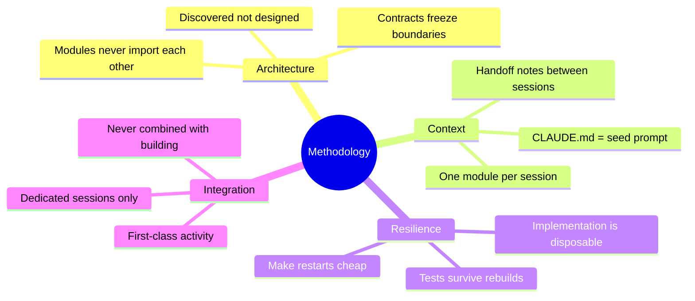
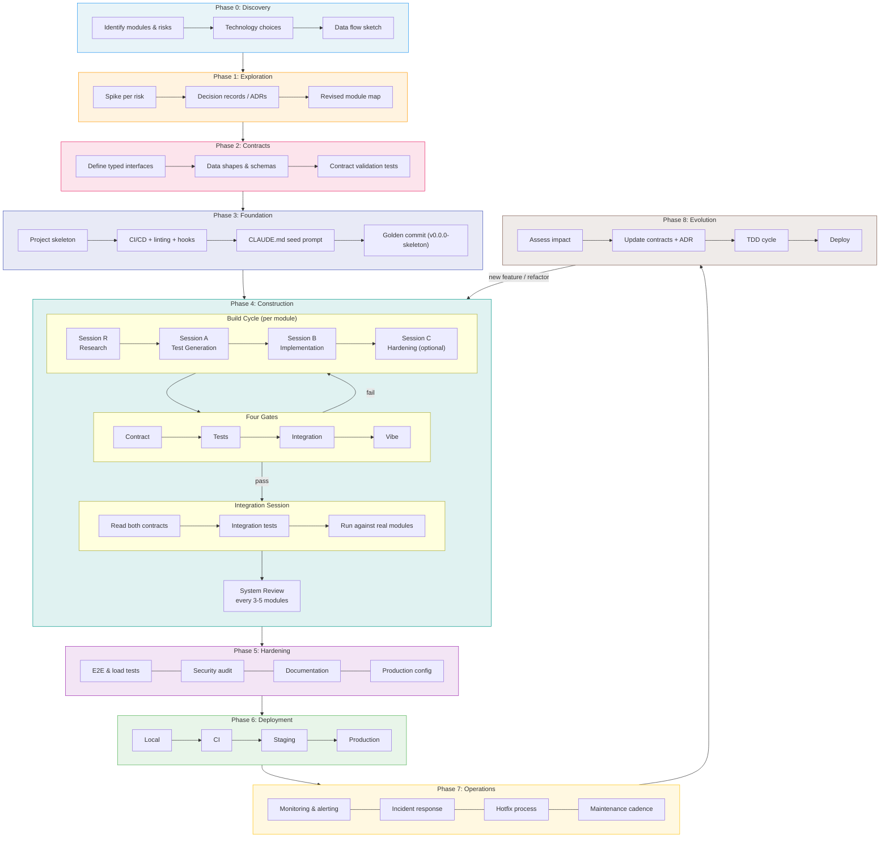
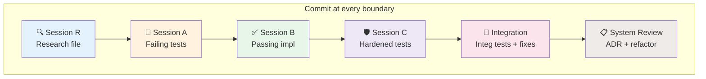
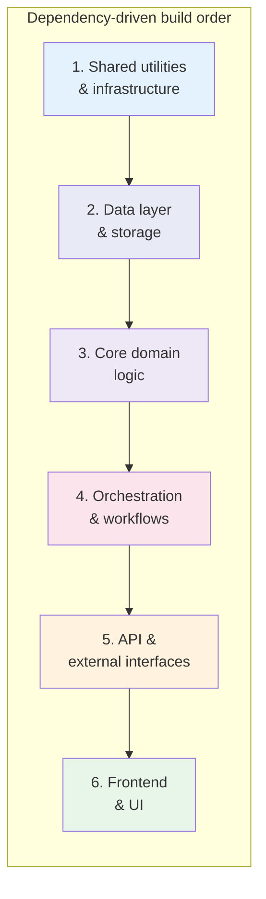
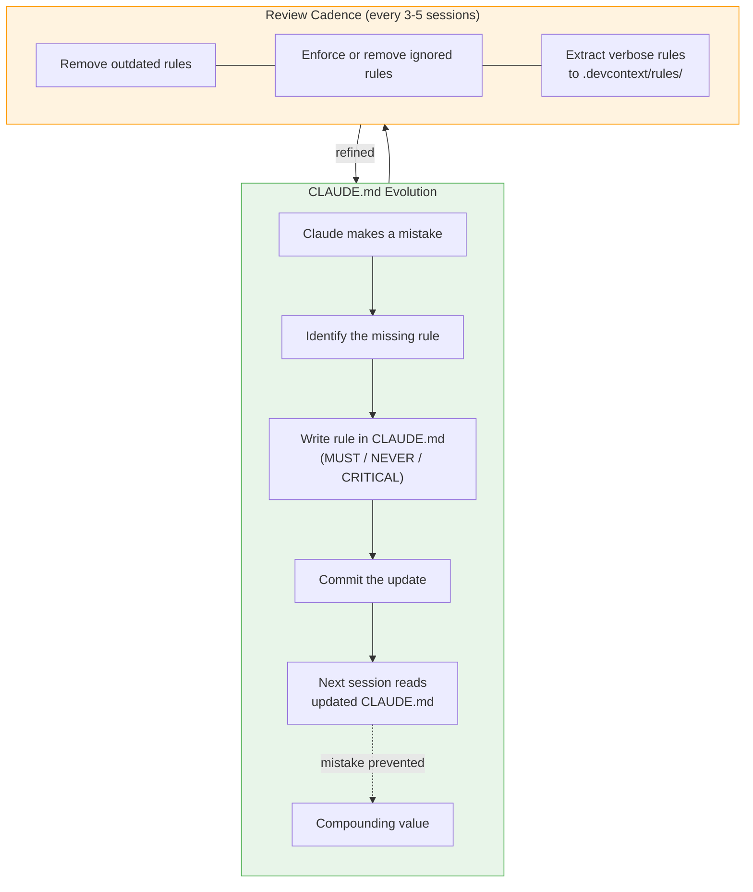
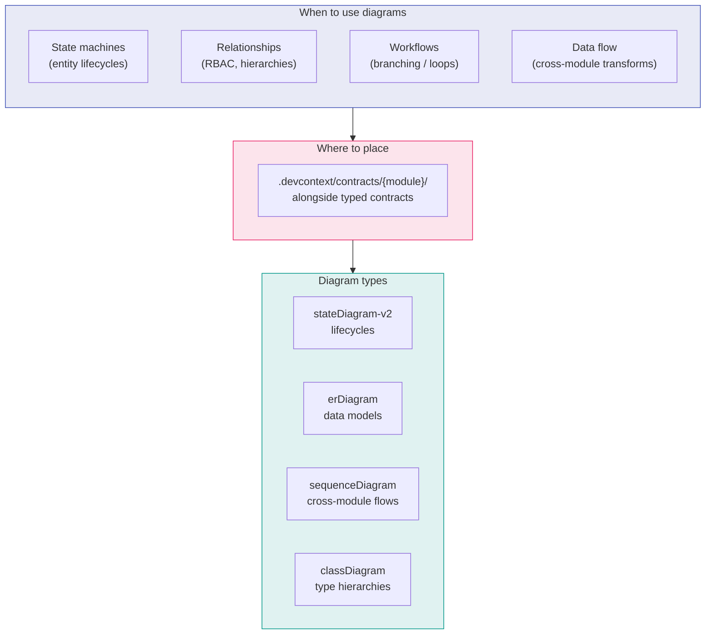
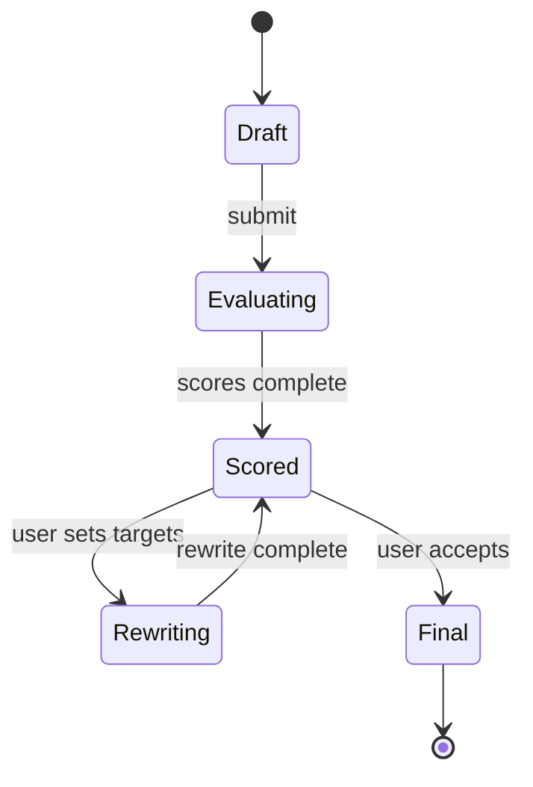
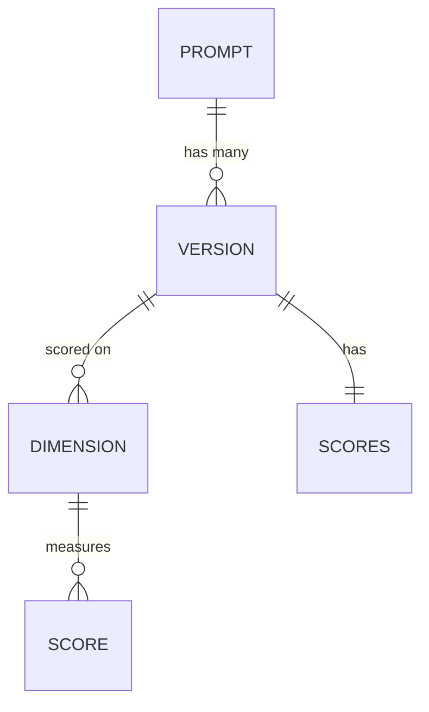
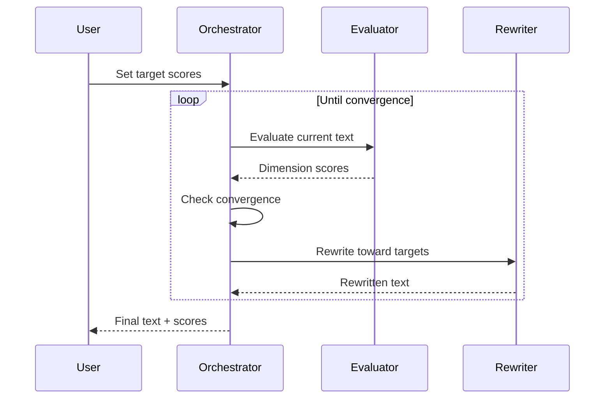

# Development Methodology for LLM-Assisted Complex Projects

**Purpose:** A repeatable, phased process for building multi-module systems using Claude Code — from first idea through production operations.

**Who this is for:** You, the solo developer or small team lead using AI coding agents as your primary implementation tool.

**Core problem this solves:** AI coding agents make locally reasonable decisions that globally conflict. Without deliberate structure, projects grow organically into systems that work but resist change. This methodology prevents that by making architecture explicit, keeping sessions scoped, and treating restarts as normal.

---

## Principles

1. **Architecture is discovered, not designed.** Early specs are hypotheses. Spikes test them. Contracts freeze only after surviving real code.
2. **Context is the bottleneck.** Every bad AI decision traces back to missing system context. The methodology's primary job is delivering the right context to the right session.
3. **Make restarts cheap, not unnecessary.** Assume modules will be thrown away and rebuilt. Tests survive rebuilds; only implementation is disposable.
4. **One module per session.** Multiple sessions can run in parallel, but a single session must never cross module boundaries.
5. **Integration is a first-class activity.** Connecting two modules is its own session, never tacked onto building one of them.



---

## Phase Overview

| Phase | Name         | Goal                                         | Typical Duration |
| ----- | ------------ | -------------------------------------------- | ---------------- |
| 0     | Discovery    | Understand what to build                     | Days             |
| 1     | Exploration  | Test risky assumptions with throwaway spikes | 1-2 weeks        |
| 2     | Contracts    | Freeze module boundaries as executable code  | Days             |
| 3     | Foundation   | Project skeleton, infra, CI/CD — zero logic  | 1-2 days         |
| 4     | Construction | Build and integrate modules via TDD          | Weeks to months  |
| 5     | Hardening    | System testing, performance, security, docs  | 1-2 weeks        |
| 6     | Deployment   | Staging → production pipeline                | Days             |
| 7     | Operations   | Monitoring, incidents, maintenance           | Ongoing          |
| 8     | Evolution    | New features, refactors, scaling             | Ongoing          |



---

## Phase 0: Discovery

**Goal:** Understand the problem well enough to identify modules and risks. No code.

### Activities

- Interview stakeholders (or yourself) about features, constraints, and priorities
- Write a rough system description — 1-2 pages, not a full PRD
- Identify 5-10 candidate modules (areas of distinct responsibility)
- Identify the 2-3 riskiest unknowns — things you're least sure will work
- List external dependencies and tools each module will interact with
- Sketch the data flow: what enters the system, how it transforms, where it lands

### Outputs

- Rough module map with one-line responsibilities
- Ranked risk list
- Technology choices (languages, databases, key libraries, infrastructure)
- A list of open questions to resolve in Phase 1

### Anti-patterns

- Writing a detailed PRD before building anything. It will be wrong.
- Choosing technologies before understanding the problem.
- Skipping this phase because "I already know what I want." You know less than you think.

### Time: 1-3 sessions of thinking, not coding.

---

## Phase 1: Exploration

**Goal:** Test your riskiest assumptions with throwaway prototypes.

### Activities

- For each risk from Phase 0, create a spike in `.devcontext/playgrounds/spike-{hypothesis}/`
- Each spike is a minimal, isolated experiment — not a module skeleton
- After each spike, write a decision record in `.devcontext/decisions/`
- Revisit the module map: does it still make sense? Adjust.

### Outputs

- Validated or invalidated assumptions
- Decision records (ADRs) explaining what you learned
- A revised module map reflecting reality
- Confidence about which architecture will actually work

### Rules

- Spikes NEVER graduate into production code. Extract the learning, burn the code.
- One spike per Claude Code session. Narrow prompt: "Build X to test whether Y works."
- A spike that fails is as valuable as one that succeeds.
- If a spike takes more than 2-3 sessions, the scope is too big — split it.

### Time: 1-3 sessions per spike. Total: 1-2 weeks.

---

## Phase 2: Contracts

**Goal:** Define the boundaries between modules as executable code.

### Activities

- Based on spike learnings, define the interfaces between all modules
- Write contracts as typed code: Pydantic models, dataclasses, SQL DDL, typed function signatures
- Place all contracts in `.devcontext/contracts/`
- Include: data shapes, workflow inputs/outputs, database schemas, error types, enums
- Write simple validation tests that ensure contract types are internally consistent

### What goes in a contract

- ✅ Data shapes that cross module boundaries
- ✅ Function/workflow signatures one module calls on another
- ✅ Database table definitions (shared schema)
- ✅ Enum definitions used by multiple modules
- ✅ Error types that propagate across boundaries
- ❌ Internal implementation types
- ❌ Helper utilities
- ❌ Configuration details

### Outputs

- `contracts/` directory — the shared vocabulary of the system
- Contract validation tests
- Updated ADRs for any contract decisions that weren't obvious

### Rules

- Contracts are the ONLY cross-module dependency. Modules never import from each other.
- Changing a contract after this phase requires a dedicated session and an ADR.
- This is precision work. Get it right — everything downstream depends on it.

### Time: 1-2 focused sessions.

---

## Phase 3: Foundation

**Goal:** Create the project structure and infrastructure. Zero business logic.

### Activities

- Set up the full directory structure (see Project Anatomy below)
- Copy contracts into the project's shared types package
- Set up infrastructure:
  - `docker-compose.yml` for local development (databases, message queues, etc.)
  - CI pipeline (GitHub Actions, etc.) — lint, type check, test on every push
  - Test framework and fixtures
  - Linting and formatting config
  - Pre-commit hooks
- Create empty module directories with markers
- Set up environment management: `.env.example`, config loading, secrets handling
- Write the `CLAUDE.md` seed prompt (see template below)
- Verify: project compiles, lints clean, CI passes with zero functionality

### Outputs

- A "golden commit" — the structural foundation. Tag it (e.g., `v0.0.0-skeleton`).
- Working CI pipeline
- Working local dev environment (`docker-compose up` and go)
- `CLAUDE.md` that every future session reads

### Rules

- This commit is sacred. Every branch starts from here or its descendants.
- No business logic. Just structure, imports, and infrastructure.
- Every module directory has a corresponding test directory.

### Time: 1-2 sessions.

---

## Phase 4: Construction

**Goal:** Build all modules via TDD, integrate them incrementally.

### The Build Cycle (per module)

**Session R — Research (before every build):**

1. Claude analyzes the module's contract, dependencies, and relevant existing code
2. Claude produces a compact research file: key file paths, line numbers, type signatures, system context relevant to this module
3. Output goes to `.devcontext/research/{module}.md` — no code, no plan yet
4. You review the research file. This is fast — scanning a 1-page summary beats re-reading source files
5. Commit the research file. This is a checkpoint.

> **Why:** The research file is the agent's working memory. Without it, every session wastes context window tokens re-reading the codebase. With it, Sessions A and B start with a compact, pre-verified context payload.

**Session A — Test Generation:**

1. Claude reads the research file + the module's contract from `.devcontext/contracts/`
2. Claude proposes test cases: happy path, error cases, edge cases, contract conformance
3. You review and approve/adjust — **review the test plan, not individual test code**
4. Claude implements the tests
5. All tests fail (nothing to test yet). Correct.
6. Commit.

**Session B — Implementation:**

1. Claude reads the research file + tests from Session A
2. Claude implements the module until all Session A tests pass
3. No new tests in this session
4. If Claude discovers uncovered cases, flag them for Session C
5. Commit.

**Session C — Test Hardening (optional, for risky modules):**

1. Add edge case tests, property-based tests, fuzz tests
2. Verify the implementation handles them
3. Commit.

### The Four Gates (pass all before proceeding)

| Gate            | Question                            | How to verify                                           |
| --------------- | ----------------------------------- | ------------------------------------------------------- |
| **Contract**    | Does it match the frozen interface? | Import tests against contracts/ pass                    |
| **Tests**       | Does it work?                       | Unit tests pass                                         |
| **Integration** | Can it talk to its neighbors?       | Integration test with built modules (mocks for unbuilt) |
| **Vibe**        | Does the code read well?            | You spot-check key files and feel good                  |

**If a gate fails:**

- Contract or Tests → fix in the current session
- Integration → dedicated integration session
- Vibe → throw away implementation, keep tests, rebuild

### Integration (after each pair passes individual gates)

1. Dedicated integration session — never inside a build session
2. Claude reads both contracts, proposes integration test cases for the boundary
3. You approve. Claude implements. Run against real modules, not mocks.
4. Integration tests go in `tests/integration/`
5. If tests fail, fix in a dedicated session

### System Review (every 3-5 modules)

- Read the integrated codebase end-to-end
- Do boundaries still make sense? Duplication? Wrong contract shapes?
- Write an ADR: "confirmed, proceed" or a refactoring plan
- Refactor now while the system is small

### Commit Discipline

Commit at every phase boundary — not just when "done." Each commit is a rollback point.

| Boundary            | What to commit                |
| ------------------- | ----------------------------- |
| After Session R     | Research file                 |
| After Session A     | Failing tests                 |
| After Session B     | Passing implementation        |
| After Session C     | Hardened tests                |
| After integration   | Integration tests + any fixes |
| After system review | ADR + any refactoring         |

**Why:** Small, frequent commits make design decisions individually revertable. If Session B goes wrong, you roll back to Session A's commit and rebuild — tests are preserved, only implementation is discarded.



### Module Build Order

Start with fewest unbuilt dependencies. Typically:

1. Pure infrastructure / shared utilities
2. Data layer / storage
3. Core domain logic
4. Orchestration / workflow layer
5. API / external interfaces
6. Frontend / UI



### Parallel Execution

Multiple modules CAN be built simultaneously if they don't share unbuilt dependencies.

- Each session gets the same `CLAUDE.md`, different module assignment
- Sessions must not modify `contracts/` or other modules' code
- If a session needs a contract change, it STOPS and flags you
- Git branches: one per module, merge to main only after gates pass

### Time: Weeks to months, depending on project size.

---

## Phase 5: Hardening

**Goal:** Prepare the integrated system for production.

### System-level Testing

- End-to-end tests covering critical user journeys
- Load / performance testing for known bottlenecks
- Failure mode testing: what happens when a dependency goes down?
- Data integrity tests: verify invariants hold under concurrency

### Security

- Dependency audit (known vulnerabilities)
- Input validation review across all API boundaries
- Auth flow testing
- Secrets management verification

### Documentation

- README with setup instructions (test on a clean machine)
- API documentation (auto-generated where possible)
- Operations runbook: deploy, rollback, debug common issues
- Architecture overview updated from rough Phase 0 doc into a real one

### Configuration

- Environment-specific configs: dev, staging, production
- Feature flags for anything that might need toggling without a redeploy
- Resource limits, timeouts, retry policies tuned for production

### Time: 1-2 weeks.

---

## Phase 6: Deployment

**Goal:** Get the system running in production safely.

### Pipeline

| Environment    | Purpose                     | Deploy trigger                |
| -------------- | --------------------------- | ----------------------------- |
| **Local**      | Development                 | `docker-compose up`           |
| **CI**         | Automated testing           | Every push                    |
| **Staging**    | Pre-production verification | Merge to main                 |
| **Production** | Real users                  | Manual promotion from staging |

### First Deploy

1. Deploy to staging. Run full test suite against it.
2. Smoke test manually: walk through critical paths yourself.
3. Deploy to production with minimal traffic / feature-flagged.
4. Monitor closely for 24-48 hours.

### Database Migrations

- Migrations always go forward, never backward. Rollback = new forward migration.
- Test migrations against a copy of production data before running them live.
- For risky migrations: deploy code handling both old and new schema first, migrate, then remove old-schema handling.

### Rollback

- Know exactly how to revert to the previous version before deploying.
- Practice the rollback once before you need it for real.

### Time: Days for first deploy. Minutes for subsequent deploys.

---

## Phase 7: Operations

**Goal:** Keep the system healthy in production. Ongoing.

### Monitoring

- Health checks — is each service up?
- Error tracking — spikes? New error types?
- Performance metrics — response times, queue depths, resource usage
- Business metrics — are workflows completing? Are users doing what they should?
- Alerting — don't alert on noise, always alert on real problems

### Incident Response

1. **Assess** — Affecting users? How many? How badly?
2. **Mitigate** — Feature-flag it off? Rollback? Scale up?
3. **Fix** — Dedicated Claude Code session. Hotfix branch.
4. **Review** — Add a test. Update the runbook. ADR if architectural.

### Hotfix Process

Hotfixes are the ONE exception to "separate test and build sessions." Speed matters.

1. Write a test that reproduces the bug
2. Fix until the test passes
3. Run the full test suite — no regressions
4. Deploy through the pipeline (don't skip staging)
5. Brief post-mortem in `.devcontext/decisions/`

### Maintenance Cadence (weekly or biweekly)

- Review error logs for patterns
- Update dependencies (especially security patches)
- Review technical debt notes
- Check resource usage trends

### Time: Ongoing. Budget 10-20% of your time.

---

## Phase 8: Evolution

**Goal:** Add features, refactor, and scale without breaking what works.

### Adding a Feature

1. **Assess impact** — which modules does this touch? Which contracts change?
2. **Update contracts first** — ADR required for any contract change
3. **Write tests from updated contract** — same as Phase 4 Session A
4. **Implement** — same as Phase 4 Session B
5. **Integration test** — against the existing live system
6. **Deploy** — normal pipeline

### Refactoring

Same rules as features, plus:

- All existing tests must pass throughout
- Big refactors split into small, independently deployable steps
- Update contracts before moving code between modules

### When to Revisit the Architecture

Red flags:

- Every new feature requires changes in 3+ modules
- Bug fixes cascade across module boundaries
- You dread working on a specific module
- New people can't understand the system structure

### Time: Ongoing. This is the normal state of a living project.

---

## Project Anatomy

```
project-root/
├── CLAUDE.md                    # Seed prompt — every session reads this
├── .devcontext/
│   ├── contracts/               # Frozen interfaces (Phase 2) + Mermaid diagrams
│   ├── research/                # Per-module research files (Phase 4 Session R)
│   ├── reference/               # Repos, docs, examples
│   ├── playgrounds/             # Throwaway spikes (Phase 1)
│   ├── decisions/               # ADRs
│   └── methodology.md           # This document
├── .claude/                     # Continuous-Claude config
├── src/
│   ├── shared/                  # Shared types from contracts
│   └── {module}/                # One directory per module
├── tests/
│   ├── unit/                    # Module tests (Phase 4 Session A)
│   ├── integration/             # Cross-module tests (Phase 4 integration)
│   └── e2e/                     # End-to-end tests (Phase 5)
├── ops/
│   ├── docker-compose.yml       # Local dev environment
│   ├── Dockerfile               # Production container
│   ├── deploy/                  # Deployment scripts / IaC
│   └── runbook.md               # Operations runbook
└── docs/                        # Architecture, API docs
```

---

## The Seed Prompt (CLAUDE.md Template)

```markdown
# [Project Name]

## What This Is

[2-3 sentences. What the system does, who it's for.]

## Tech Stack

[Bullet list. Languages, frameworks, databases, key libraries.]

## Architecture Overview

[One paragraph. How modules fit together.]

## Module Map

| Module | Responsibility | Status                                 |
| ------ | -------------- | -------------------------------------- |
| ...    | ...            | spike / building / stable / production |

## Invariants (NEVER violate these)

[Numbered list of 5-15 architectural rules.]

## Where To Find Context

- Frozen contracts: .devcontext/contracts/
- Architecture decisions: .devcontext/decisions/
- Reference implementations: .devcontext/reference/
- Module specs: .devcontext/contracts/{module}/SPEC.md

## Session Rules

- You are working on ONE module at a time. Ask which if unclear.
- Import shared types ONLY from shared/. Never define cross-module types locally.
- If you need to change a contract, STOP and ask. Do not modify contracts.
- After completing work, summarize what was done in a handoff note.
```

---

## Testing Strategy

| Level                    | What to verify                       | Derived from              | Location                 |
| ------------------------ | ------------------------------------ | ------------------------- | ------------------------ |
| **Unit**                 | Module behavior in isolation         | Module's contract/spec    | `tests/unit/{module}/`   |
| **Contract conformance** | Actual I/O matches typed definitions | Contract type definitions | `tests/unit/{module}/`   |
| **Integration**          | Two modules communicate correctly    | Pair of contracts         | `tests/integration/`     |
| **End-to-end**           | Critical user journeys work          | System description        | `tests/e2e/`             |
| **Performance**          | System handles expected load         | Capacity requirements     | `tests/e2e/` or separate |

---

## Checklists

### Starting a Claude Code Session

- [ ] What module am I working on? (exactly one)
- [ ] What type of session? (test / build / integration / hardening / hotfix)
- [ ] Are dependencies built or mocked?
- [ ] Is CLAUDE.md up to date?
- [ ] Am I on a clean git branch?

### Ending a Claude Code Session

- [ ] Does the work pass relevant gates?
- [ ] Handoff note written?
- [ ] Does CLAUDE.md need a status update?
- [ ] Any contract change requests to flag?

### Deploying to Production

- [ ] All tests pass (unit, integration, e2e)
- [ ] Migrations tested against production data copy
- [ ] Rollback plan documented and tested
- [ ] Monitoring dashboards open, alerts configured
- [ ] Feature flags in correct state
- [ ] Someone is watching

### Post-Incident

- [ ] Fix deployed
- [ ] Test added that would have caught this
- [ ] Runbook updated
- [ ] ADR if architectural issue revealed

---

## Failure Modes

| Failure Mode             | Symptom                                    | Fix                                             |
| ------------------------ | ------------------------------------------ | ----------------------------------------------- |
| Context starvation       | Claude contradicts the architecture        | Improve CLAUDE.md                               |
| Contract drift           | Module outputs don't match neighbor inputs | Add contract conformance tests                  |
| Scope creep              | Session touches outside files              | Enforce session rules; maybe wrong boundary     |
| Sunk cost resistance     | Patching instead of rebuilding             | Tests survive rebuilds; implementation is cheap |
| Parallel drift           | Simultaneous sessions conflict             | Contract is incomplete — add what's missing     |
| Gold-plating             | Endless refinement                         | Four gates define done                          |
| Production tunnel vision | All time spent firefighting                | Budget 10-20% for ops; fix the systemic issue   |
| Stale docs               | CLAUDE.md doesn't match reality            | Update docs as part of every deploy             |

---

## CLAUDE.md Evolution

CLAUDE.md is a living document, not a static template. It improves through a feedback loop:

### Adding Learned Failure Modes

When Claude makes a mistake that a rule could have prevented, add it immediately:

1. **Identify the pattern** — What went wrong? What instruction was missing or ambiguous?
2. **Write the rule** — Add it to CLAUDE.md's Invariants or Session Rules section. Use strong, unambiguous language: "MUST", "NEVER", "CRITICAL".
3. **Commit the update** — This is a checkpoint, same as any other.

### What to add

- ✅ Mistakes Claude repeated across sessions → "NEVER do X because Y"
- ✅ Implicit assumptions Claude got wrong → Make them explicit
- ✅ Edge cases that caused bugs → "When X, ALWAYS do Y"
- ✅ Ambiguous instructions that were misinterpreted → Rewrite clearly
- ❌ One-off issues unlikely to recur
- ❌ Implementation details that belong in contracts

### Review cadence

Every 3-5 sessions, re-read CLAUDE.md critically:

- Are rules still accurate? Remove outdated ones.
- Are any rules routinely ignored? Either enforce or remove.
- Is the document getting too long? Extract detailed rules into `.devcontext/rules/` and link from CLAUDE.md.

> **Why:** Every bad AI decision traces back to missing context. The cheapest fix is a one-line rule that prevents the mistake forever. Accumulating these rules is how CLAUDE.md compounds in value over the life of the project.



---

## Diagrams for Complex Logic

Plain text specs are insufficient for complex business rules. When a module involves non-trivial relationships, state machines, or multi-step workflows, provide visual specs.

### When to use diagrams

- **State machines** — Any entity with lifecycle states (e.g., draft → review → published)
- **Relationships** — RBAC, entity hierarchies, ownership models
- **Workflows** — Multi-step processes with branching or loops
- **Data flow** — How data transforms across module boundaries



### Format

Use Mermaid in markdown files. Place diagrams in `.devcontext/contracts/{module}/` alongside the typed contracts.

### Examples

**State diagram** for an entity lifecycle:



**Entity relationship diagram** for data models:



**Sequence diagram** for cross-module workflows:



### Rules

- Diagrams are part of the contract, not decoration. Keep them in sync with typed interfaces.
- Include worked examples with concrete values (e.g., "User with role=editor can access X but not Y").
- A diagram that contradicts the typed contract is a bug — fix one or the other immediately.
