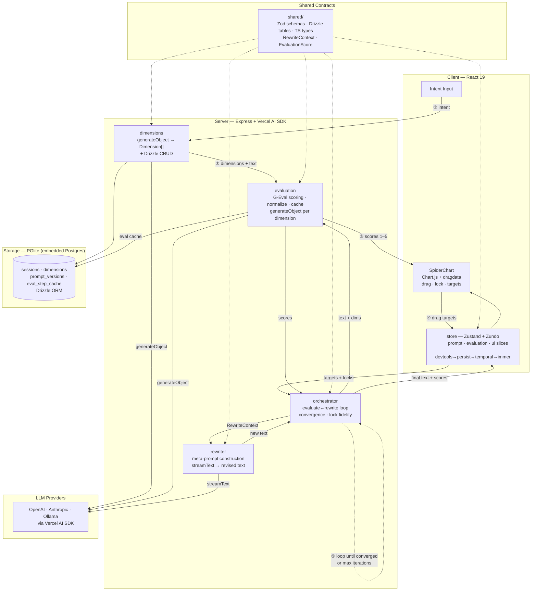

# textchisel

A prompt engineering workbench that helps users iteratively refine LLM prompts through visual feedback. Describe your writing intent, get evaluation dimensions, score text on a spider chart, drag chart points to set targets, and watch the system rewrite toward your goals.

## Architecture

### Data flow

1. User describes writing **intent** (e.g. "Write a cold email to a Series B investor")
2. **dimensions** module generates 3 evaluation dimensions with rubrics via LLM
3. **evaluation** module scores the text on each dimension using G-Eval (1–5 scale)
4. Scores appear on the **spider chart** — user drags points to set target scores, locks dimensions to preserve
5. **orchestrator** runs the refinement loop:
   - **rewriter** constructs a meta-prompt from current scores, targets, and locks, then streams revised text
   - **evaluation** re-scores the new text
   - Loop repeats until scores converge to targets or max iterations reached
   - Lock fidelity is checked each iteration — deviations on locked dimensions are flagged

### Module boundaries

All modules import types exclusively from `shared/`. Peer modules (dimensions, evaluation, chart) never import from each other. The orchestrator receives scoring and rewriting functions via dependency injection rather than importing them directly.

### Tech stack

| Layer    | Technology                                         |
| -------- | -------------------------------------------------- |
| Frontend | React 19, Vite, Tailwind CSS v4                    |
| State    | Zustand + Zundo (undo/redo), PGlite `useLiveQuery` |
| Chart    | Chart.js + chartjs-plugin-dragdata                 |
| LLM      | Vercel AI SDK (`generateObject`, `streamText`)     |
| Database | PGlite (embedded Postgres) + Drizzle ORM           |
| Server   | Express (serves UI + proxies LLM calls)            |
| Quality  | qlty CLI (ESLint 9 + Prettier + osv-scanner)       |
| Tests    | Vitest + jsdom + @testing-library/react            |
